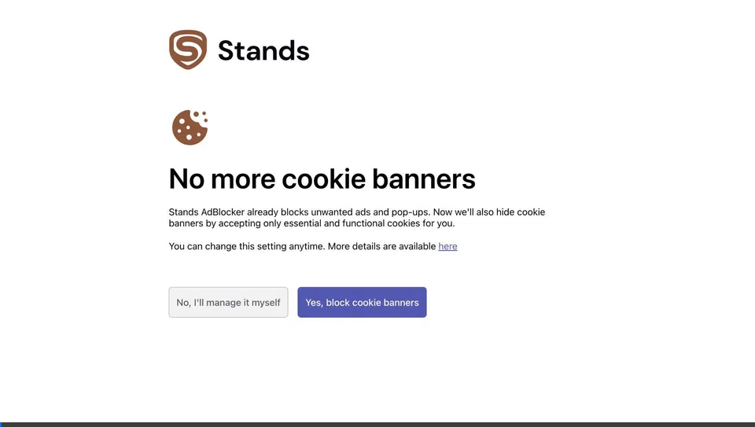

# Premier League Scores ⚽

Premier League Scores is a dark-themed web hub for following the English Premier League. It delivers live-updating matchday fixtures, local kickoff times, final scores with expandable goalscorers, and the complete 20-club league table with European qualification and relegation zones. The application is completely free to run with zero API keys or external account signups required.

> **Proud Gooner Note:** This is made by an Arsenal fan who is a proud Gooner and COYG! 🔴⚪

---

## 📹 Preview & Demo



---

## Features

- **Live & Finished Match Scores**: Auto-refreshes every 60 seconds with live polling.
- **Matchday Navigation**: Seamlessly navigate between fixtures from Matchday 1 to 38.
- **Goal Details**: Click any finished fixture to view timestamps, goalscorers, and penalties.
- **League Standings**: Full 20-club table with qualification zones for UEFA Champions League (Top 4), Europa League (5th), and Relegation (Bottom 3).
- **Cheeky 3D Football Icon**: Smooth organic X/Y axis 3D tilt animation on the header soccer ball with hover kick dynamics.
- **Dark Theme Only**: Elegant `#0a0a0b` palette with layered `#141417` surfaces, subtle highlights, and Arsenal red accents.

---

## Data Source

Match and standings data are provided by [OpenLigaDB](https://www.openligadb.de) via their free, open community API (`https://api.openligadb.de`). No registration or authentication keys are needed.

---

## Architecture

```
React 18 + Vite (dark UI)  →  FastAPI backend  →  OpenLigaDB (api.openligadb.de)
                                    ↳ in-memory TTL cache (60s per upstream URL)
```

The frontend never communicates directly with OpenLigaDB. Instead, a lightweight FastAPI backend handles requests, caches upstream payloads in memory with a 60-second time-to-live (TTL), and normalizes data into structured response models for the client. In production, FastAPI also serves the pre-built React application directly from `/`.

---

## Free Forever Live Deployment (Host for Free)

You can run this application live on the web forever at zero cost:

### Option 1: One-Click Render Deployment (Recommended)

1. Push this repository to your GitHub account.
2. Go to [Render.com](https://render.com) and click **New + > Blueprint** (or **Web Service**).
3. Connect your repository. Render automatically reads [render.yaml](render.yaml):
   - **Build Command:** `cd frontend && npm install && npm run build && cd ../backend && pip install -r requirements.txt`
   - **Start Command:** `cd backend && uvicorn app.main:app --host 0.0.0.0 --port $PORT`
4. Click **Deploy**. Your app will be live with a permanent HTTPS URL (e.g., `https://premier-league-scores.onrender.com`).

### Option 2: Docker Deployment

Deploy to any container host (Render, Railway, Fly.io, Hugging Face Spaces, Koyeb) using the included multi-stage [Dockerfile](Dockerfile):

```bash
# Build the container
docker build -t premier-league-scores .

# Run the container on port 8000
docker run -p 8000:8000 premier-league-scores
```

---

## Local Development Setup

### 1. Backend

Requirements: Python 3.11+

```bash
cd backend

# Create and activate virtual environment
python3 -m venv venv
source venv/bin/activate  # On Windows: venv\Scripts\activate

# Install dependencies
pip install -r requirements.txt

# Start the API server
uvicorn app.main:app --reload --port 8000
```

The backend API will be available at `http://localhost:8000`. You can test health with:
```bash
curl http://localhost:8000/api/health
```

### 2. Frontend

Requirements: Node.js 18+

```bash
cd frontend

# Install dependencies
npm install

# Start Vite dev server
npm run dev
```

The application will be running at `http://localhost:5173`.

---

## Measured Performance

In local testing on macOS with Python 3.14 and Uvicorn:
- **Upstream fetch + cache write:** ~10.9 ms
- **Cached in-memory response (within 60s TTL):** ~0.5 ms

---

## Honest Limitations

- **Derived Live Match Status:** The upstream OpenLigaDB API does not provide a real-time "in-play" flag for Premier League fixtures. Match status is derived by checking whether a fixture is unfinished, its kickoff time has passed, and less than 2 hours have elapsed since kickoff.
- **Data Freshness:** Scores, goal events, and standings depend directly on the update frequency of volunteer contributors on OpenLigaDB.
- **Crest URLs & Goal Details:** Certain clubs or historical fixtures may lack full crest images or detailed goal event logs upstream; fallback initials and empty notices are rendered defensively.
